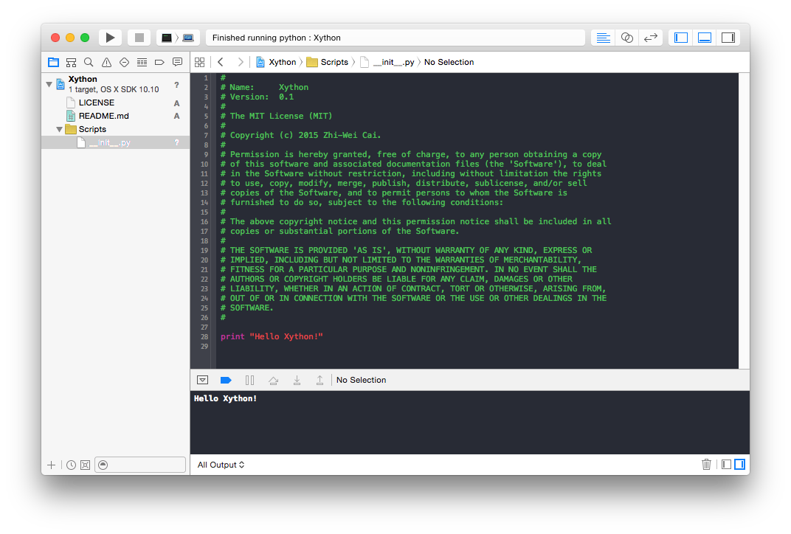

#Xython

    

**Xython** is a Xcode project template for Python.

##Usage 

Modify the `__init__.py` and run in Xcode to see the result.

> You will need to change the settings in `Schemes` if you wish to use Python 3.x.

##Changelog

- **0.1**：Initial release. 

##License

See the `LICENSE` file.